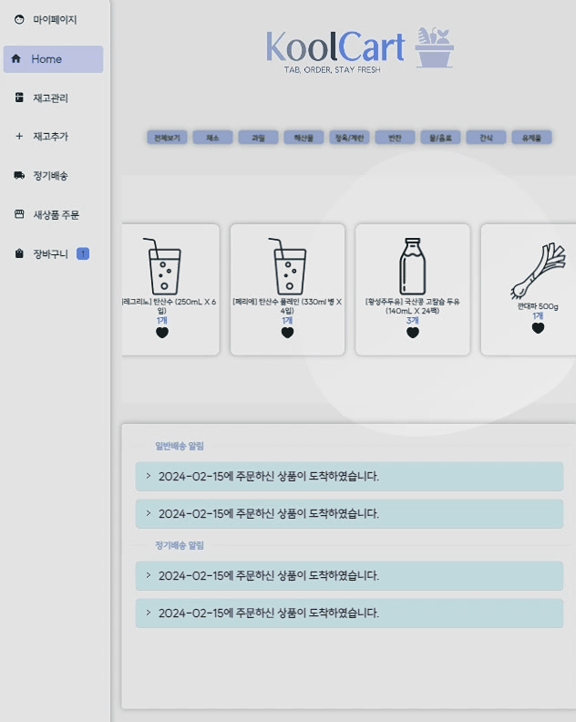

# 🛒 KoolCart
### 기획 의도
- 서비스 타겟 설정 : 식재료를 주로 인터넷 쇼핑몰에서 구매하는 사람
- 문제인식 
  - 냉장고에 어떤 식료품이 얼마나 남아있는지 간편하게 파악하기가 어렵다.
  - 주로 식재료를 온라인으로 주문하기 때문에 주문 및 배송과 동시에 냉장고 재고 상황이 자동으로 갱신되고 유통기한까지 관리되면 편리할 것이다. 
  - 재고 관리가 안돼서 유통기한이 지난 식품을 버리게 되는 상황을 피하고 싶다
- 개선방안 
  - 온라인 쇼핑몰과 연동하여 해당 쇼핑몰에서 주문한 식재료는 배송과 동시에 웹 애플리케이션에서 재고 및 유통기한을 확인할 수 있게 한다. 
  - 유통기한이 일정 기간 이하로 남은 품목을 알림메세지로 알려준다. 이를 통해 냉장고에 어떤 식재료가 얼마나 남아있는지 쉽게 알 수 있다. 
  - 여기에 현재 관리하고 있는 재고를 쉽게 앱에서 바로 재주문 할 수 있도록 한다. 만약 내 냉장고에 없는 품목이라면 쇼핑몰에서 실제 판매 중인 상품 중 검색을 통해 바로 주문할 수 있다. 
<br/>
<br/>


# 📜 목차  
<br/>

1. 개발 환경
2. 서비스 화면과 주요 기능
3. 기술 소개
4. 설계 문서
5. 팀원 소개  
<br/>
  
# 1. 개발환경 

🔨 **Management Tool**


💻 **IDE**


🐧 **Infra**
  


✨ **Frontend**


📦 **Backend**


<br />

⚙ **Hardware**


<br />


# 2. 서비스 화면과 주요 기능
## 대기화면
> 사용자와의 거리를 인식하여 일정 거리 이하로 사용자가 다가오면 자동으로 화면이 켜집니다.

<p align="center">
   
  
</p>

> 현재 날짜와 시각, 날씨 정보 그리고 냉장고의 내부 온도 및 습도를 확인할 수 있습니다.

> 알림센터에서 일반배송 완료 알림, 정기배송 예고/완료 알림, 유통기한 임박 상품 알림을 확인할 수 있습니다. 알림별 이동 버튼을 누르면 재고 관리 페이지로 이동하며 해당 알림은 대기화면 알림창에서 삭제됩니다. 전체확인 버튼을 누를 경우 대기화면에서 나타나는 모든 알림메세지를 삭제할 수 있습니다.
 
## 메인페이지


> 사용자의 냉장고 품목 중 즐겨찾기한 재고를 전체 혹은 카테고리별로 조회할 수 있습니다. 즐겨찾기 버튼을 한 번 더 누를 경우 해당 품목 즐겨찾기가 해제됩니다.



> 일반 배송/ 정기 배송이 완료된 경우 알림메세지가 전송되며 이를 메인화면에서 조회할 수 있습니다. 나아가 확인 버튼을 누르면 해당 주문에 포함된 상품들이 자동으로 재고에 추가됩니다.


> 유통기한이 지났거나 임박한 품목을 전체 혹은 카테고리 별로 조회할 수 있습니다.

## 재고관리


> 현재 냉장고에 있는 전체 재고를 확인할 수 있습니다. 상품명, 유통기한, 수량이 함께 표시됩니다.
유통기한, 등록일자, 가나다순으로 정렬할 수 있습니다.  


> 목록의 장바구니 아이콘을 클릭하면 해당 상품과 동일한 상품 또는 비슷한 상품을 장바구니에 추가할 수 있습니다. 


> 개별 재고를 클릭하면 해당 재고와 동일한 카테고리에 속한 상품의 상세정보를 함께 확인할 수 있으며, 상품별로 즐겨찾기가 가능합니다. 해당 상품을 소비 혹은 구매한 경우 버튼으로 수량 조절이 가능합니다. 

## 재고추가


> 애플리케이션과 연계된 인터넷 쇼핑몰에서 구매하지 않은 상품의 경우 사용자가 직접 냉장고의 재고로 등록할 수 있습니다. 이때 등록할 재고의 카테고리를 선택할 수 있으며, 제품명과 수량, 그리고 유통기한을 임의로 기입할 수 있습니다. 


> 한 번에 여러 개의 품목을 등록하고 싶은 경우, 모든 품목에 관한 정보를 차례로 기입하고 한 번에 등록할 수 있습니다. 
## 정기배송


> 정기배송을 원하는 상품과 배송 주기, 수량, 최초배송일을 지정하여 정기배송을 신청할 수 있습니다.

<p align="center">
   
  
</p>

> 이미 등록된 정기배송 신청내역을 확인할 수 있습니다.
상세조회 버튼을 누르면 초기에 설정한 정기 배송 정보를 변경하거나 해지할 수 있습니다. 

 

> 지금 구매 버튼을 누를 경우 바로 주문이 가능하며 해당 시점을 기준으로 배송기준일이 갱신됩니다.

 

> 이번 배송 건너뛰기 버튼을 누를 경우 예정된 배송완료일을 기준으로 배송 주기가 늘어납니다.

 

> 배송예정순 혹은 사용자 지정 순으로 신청내역을 확인할 수 있습니다. 드래그 앤 드롭으로 사용자 지정 설정이 가능합니다.

## 주문하기

 

> 쇼핑몰에서 주문하는 것과 마찬가지로 동일한 카테고리를 기준으로 구매 가능한 상품을 조회하고 장바구니에 담을 수 있습니다. 
## 장바구니

 

> 장바구니에 담은 품목과 총금액을 조회할 수 있습니다. 
원하는 상품만 선택하여 주문하거나 전체 상품을 한 번에 주문할 수 있습니다. 

 

> 장바구니에 담은 품목이 없는 경우 장보기 버튼을 누르면 주문하기 페이지로 바로 이동할 수 있습니다.  


## 로그인/회원가입 및 마이페이지

 

> 회원가입 및 로그인을 해야 애플리케이션의 서비스를 이용할 수 있습니다. 
> 비밀번호, 이메일, 전화번호, 주소를 변경할 수 있습니다. 

# 3. 기술 설계


# 4. 설계 문서

<p align="center">
  
  
</p>

# 5. 팀원 소개 및 역할 분담
## 박건률 : 팀장

#### 프론트엔드
재고 관리 페이지
 - 기본탭에서 이용자의 재고를 같은 상품을 기준으로 Group 지어서 표시해줍니다.
 - 유통기한, 최신순, ㄱ-ㄴ 탭을 선택함으로 원하는 정렬이 가능합니다.
 - 상세 제품 목록에서 동일 카테고리 품목의 제품을 유통기한별 수량을 보여줍니다.

#### 백엔드 
재고 관리 페이지
 - 사용자의 냉장고 재고 확인

쇼핑몰 연동을 통한 원클릭 주문
 - 기존 쇼핑몰에서 구매하였던 제품을 KoolCart측에서 즉시 주문하거나 추천 상품을 바로 주문 가능합니다.

재고 유통기한 알림
 - 매일 자정에 DB를 확인하여 유통기한이 3일이하거나 만료된 제품들 정보를 message 테이블에 넣어줌

재고 관리 API
 - 전체 재고 확인
 - 유통기한 3일 이내인 재고만 가져오기
 - 즐겨찾기된 제품만 가져오기
 - 수량이 0이된 제품들 삭제
 - sub_category에 맞는 재고를 가져오기
 - sub_category에 맞는 재고를 유통기한 순으로 정렬해서 가져오기
 - main_category에 맞는 재고를 유통기한 순으로 정렬해서 가져오기
 - 재고 즐겨찾기 toggle
 - 재고 관리 페이지에서 수량 +, - 로 조절
 
#### 기타
Gitlab 코드 관리

## 노현경

#### 로그인 페이지
- 기존에 회원가입한 사용자의 user sequence(user_seq)를 서버에 저장
- QR간편로그인으로 핸드폰으로 QR코드를 촬영해 모바일로 회원가입 후 QR 아래의 로그인 버튼을 누르면 가입된 정보로 바로 로그인

##### 백엔드
- 유저가 입력한 아이디가 DB에 POST로 요청
- 해당 아이디와 같은 user sequence에 저장된 비밀번호가 유저가 입력한 비밀번호와 같은지 확인
- 위의 두 정보가 확인되면 로그인 할 user_seq를 반환
- 하나라도 일치하지 않을 경우 0을 반환
- QR로그인을 누르면 DB에 저장된 user_seq를 조회해 다음에 가입할 user_seq를 반환
- 모바일 회원가입 후 로그인하기를 누르면 반환했던 user_seq에 저장된 정보가 있는지를 확인하고 정보가 있으면 1을 반환, 없으면 0을 반환

##### 프론트엔드
- 사용자가 정보를 입력하고 버튼을 눌러 로그인 요청을 보낼 수 있도록 설계
- user_seq가 반환 될 경우 redux-persist를 이용해 새로고침해도 서버에 user_seq가 저장되도록 설정
- 백엔드에서 0이 반환되면 사용자에게 alert창으로 입력한 정보를 확인하도록 안내
- 회원가입하기 버튼을 누르면 회원가입 페이지로 이동
-QR로그인 모달창을 클릭했을 때 벡엔드에서 반환되는 user_seq로 모바일회원가입용 QR코드 생성
-QR로그인하기 버튼을 눌렀을 때 벡엔드에서 반환되는 값이 0이면 alert로 회원가입을 진행하도록 안내, 1이 반환되면 QR코드 생성 시 이용한 user_seq를 서버에 저장 및 로그인


#### 회원가입 페이지
- 사용자의 이름, 아이디, 비밀번호, 이메일, 이메일도메인, 전화번호, 주소정보(카카오 주소찾기 api 이용) 정보를 받아 user DB에 저장

##### 백엔드
- 사용자가 저장한 정보를 user DB에 저장하고 저장된 DB의 user_seq를 반환
- 모바일 회원가입의 경우 ResponseEntity.ok 반환

##### 프론트엔드
- 회원가입 버튼을 눌렀을 때 반환되는 user_seq의 정보를 redux-persist로 저장
- 모바읠 회원가입의 경우 디스플레이의 로그인하기 버튼을 누르도록 alert 안내


#### 마이페이지 페이지
- 사용자가 회원가입 시에 입력한 정보를 확인하고 수정할 수 있음

##### 백엔드
- user_seq의 user DB 전체 정보를 반환
- 사용자가 입력한 정보를 PUT으로 DB에 저장

##### 프론트엔드
- user_seq를 토대로 기존에 입력된 유저 정보를 표기
- 아이디, 이름은 read only로 설정하여 수정 불가하게 설정
- 로그아웃 버튼을 누르면 user_seq를 0으로 변경 후 로그인 페이지로 이동

## 이규형

#### 정기배송 페이지

#### 백엔드
- **정기 배송 관리 기능 개발:**
  - 사용자가 정기 배송을 신청하고 관리할 수 있도록 하는 백엔드 로직을 Spring Boot와 Spring Data JPA를 사용하여 구현. 이에 포함되는 기능은 정기 배송 신청, 수정, 조회, 삭제 등이 있음.
  
- **정기 배송 스케줄링 및 알림 시스템:**
  - `@EnableScheduling` 어노테이션을 활용하여 매일 정해진 시간에 정기 배송 주문을 자동으로 처리하고, 배송일 하루 전에 사용자에게 알림을 발송하는 로직 개발.

- **정기 배송 주문 즉시 처리 및 건너뛰기 로직:**
  - 사용자가 정기 배송을 즉시 실행할 수 있는 로직과 다음 정기 배송을 건너뛰기 위한 로직을 구현. 이는 사용자가 자신의 배송 스케줄을 유연하게 관리할 수 있도록 지원함.

#### 프론트엔드
- **정기 배송 신청 및 관리 인터페이스:**
  - React와 Redux를 사용하여 정기 배송 신청 폼 및 관리 페이지의 사용자 인터페이스를 설계 및 구현. 사용자가 정기 배송을 쉽게 신청하고, 자신의 정기 배송 리스트를 관리할 수 있도록 함.

- **정기 배송 리스트 정렬 및 상품 선택 UI:**
  - `react-beautiful-dnd`를 활용하여 사용자가 자신의 정기 배송 리스트를 드래그 앤 드롭으로 정렬할 수 있는 인터페이스 구현. 또한, 쇼핑몰 API와 통합하여 실시간으로 상품 정보를 조회하고 정기 배송으로 선택할 수 있는 기능 개발.

- **지금 구매 및 건너뛰기 기능 UI:**
  - 사용자가 정기 배송을 즉시 실행하거나 다음 배송을 건너뛸 수 있는 버튼을 포함한 UI 구현. 이를 통해 사용자는 정기 배송 일정을 보다 유연하게 관리할 수 있음.

## 이수민
### <냉장고 애플리케이션 - KoolCart>

#### 백엔드 
- 장바구니 페이지
: 사용자의 장바구니 품목 조회, 삭제, 생성, 수량 수정 
#### 프론트엔드 
- 메인페이지
: 사용자의 즐겨찾기 재고, 유통기한 만료 및 임박상품 조회, 알림메세지 조회 및 확인
- 장바구니 페이지 
: 장바구니 품목을 조회, 수량 변경, 삭제, 선택한 상품만 주문할 수 있는 기능 / 장바구니 품목이 없는 경우
새상품 주문 페이지로 연결
- 새상품 주문페이지 
: 쇼핑몰에서 받아온 카테고리별 상품 조회, 장바구니에 추가 기능

### <쇼핑몰 서버>

#### 백엔드

API로 클라이언트와 요청 및 응답 주고받기
- 상품 카테고리별 상품 리스트 보여주기
- 쇼핑몰 카테고리 리스트 보여주기
- 개별 상품 상세 정보 보여주기
- 쇼핑몰 주문 생성
- 쇼핑몰 주문 정보 보여주기 : 해당 주문에 포함된 상품의 상세 정보 리스트 

Celery 사용 비동기 작업 수행 : 주문 데이터 생성에 성공하면 앱서버에 message table에 배송 알림 메세지를 생성하도록 post요청을 보냄. 이를 위해 브로커로는 redis를 사용

## 임병은
### <냉장고 애플리케이션 - KoolCart>
### 수기 입고 기능
#### 백엔드 - 스프링 부트, JPA, MySql을 활용하여 개발
- DB에 재고 Table 생성 후 해당 테이블에 접근하여 사용자가 입력한 정보를 저장.
- 단일품목 입력 시 마다 저장되는 것이 아니고, 프론트 페이지에서 최종적으로 저장 목록(리스트) 형태로 여라 제품을 post 요청.
- 전달 받은 데이터를 반복문을 통해 각 제품을 차례대로 저장.
- 유저 고유번호(user_seq), 소분류 고유번호(sctg_seq) 의 경우 외래키 참조.
- 쇼핑몰에서 사용하는 상품 고유번호(pdt_seq) 는 default 0으로 저장.

#### 프론트엔드 - react, react-vite
- 냉장고 디스플레이에서 사용한다는 점을 감안하여 간단화 된 UI 제공
- 수량의 경우 +,- 버튼을 통해 조작이 가능
- 유통기한의 경우 시간 관리를 위애 date-time 형태로 입력 받으며, 달력 제시
- 대분류, 소분류의 경우 쇼핑몰에서 api 를 통해 받아와 store에 카테고리 정보를 저장하고 해당 카테고리를 select 할 수 있도록 표시. 선택한 대분류에 맞게 소분류 표시
- 임시 재고
    - 데이터 입력을 통해 품목을 추가하면 이를 프론트 단에서 임시 재고 리스트에 담음
    - 아래 추가 목록에 해당 리스트를 보여주고 실시간으로 잘 못 입력된 제품의 경우 삭제가 가능
    - 최종적으로 ‘입력 완료’ 버튼을 누르면 해당 추가목록 리스트를 DB에 저장하도록 api 요청을 보냄
- MUI 라이브러리를 적극 활용하여 최대한 사용자에게 깔끔하고 간단화된 페이지를 제공
    - 타이포그라피, 테이블, input 등


## 조한준
#### Full-Stack 

<br>

1. 센서 실시간 모니터링 자동화 (Embedded)

    
    - 기능 1) 실시간 사용자 접근/이탈에 따른 화면 밝기 제어
    ```사용자의 접근이 없을 경우의 전력 소모량 감소하여 전력 효율 높임```
    - 기능 2) 냉장고 내부의 온/습도 실시간 모니터링
    ```냉장고 내부의 비정상적 온/습도를 대기화면 UI에서 실시간 감지 가능```
    - 기능 3) 디스플레이 최초 부팅 시 키오스크 모드 및 센서 동작 자동화
    ```자동화 스크립트를 제작해 사용자가 구매 후 바로 서비스를 사용할 수 있도록 배포```

<br>

2. 디스플레이 대기화면 제작 (Frontend)

    - 기능 1) 사용자가 설정한 지역의 날짜/시간/날씨를 확인 가능
    - 기능 2) 냉장고 내부의 온/습도 모니터링 UI 구현
    - 기능 3) 알림 센터 (Notification Center) 구현
    ```
        - 유통기한 알림
            -유통기한 임박 상품명 및 잔여일 알림
        - 정기배송 알림
            - 정기주문 예정이 임박한 품목 알림
            - 정기배송 완료된 품목 알림
        - 배송현황 알림
            - 사용자가 직접 주문한 품목들의 배송현황 알림
    ```


<br>

3. 알림(Message) 관련 API 구현 (Backend)

    - 기능 1) 알림 생성 API
    ```유통기한, 정기배송, 쇼핑몰로부터 카테고리 별 알림 생성 후 DB에 저장```

    - 기능 2) 알림 데이터 가져오는 API
    ```DB로부터 사용자가 확인하지 않은 알림들을 카테고리 별로 가져옴```

    - 기능 3) 알림 업데이트 API
    ```사용자가 알림 확인 시 DB에 확인 여부 업데이트```


